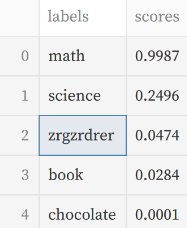

# NLP - Word Relevance
 

This small project implements a pretrained transformer model accessible through a streamlit interface. It uses FastAPI for direct interaction between the app and the model.

Using the streamlit interface you can search for word relevance in the context of the provided text.

You can pick a different model from the drop-down menu, although be aware that when using a model for the first time, it will automatically be downloaded from huggingface. This can take up to several minutes.

## Setup
- Python interpreter is needed: install python from https://www.python.org/downloads/
- Make sure to install the required packages by executing the following command: `pip install -r requirements.txt`

## Usage
To run this app locally you must run these commands in separate terminals:
- `uvicorn api:api --reload` will start the FastAPI local server
- `streamlit run app.py` will start the streamlit local server

## Limitations
Complete nonsense letter sequences can sometimes score higher than real but irrelevant words.

